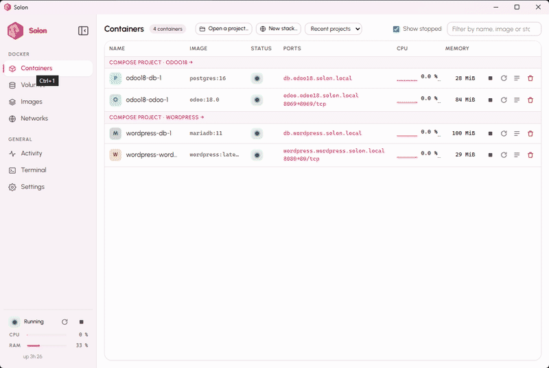
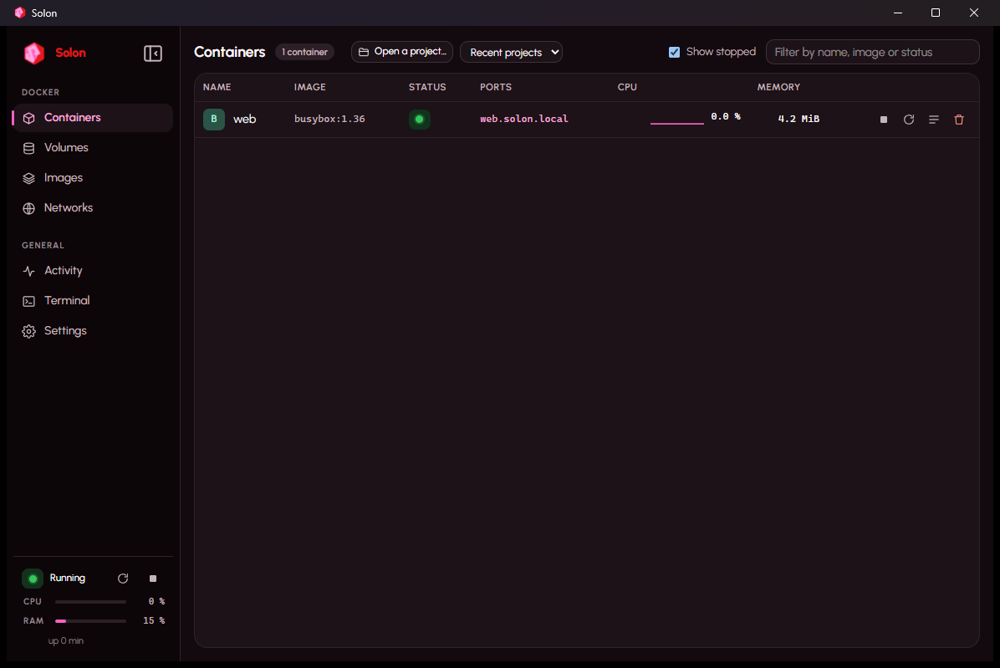

#  Solon

*Version française : [README.fr.md](README.fr.md).*

[](https://github.com/v94lere/solon/actions/workflows/ci.yml) [](https://github.com/v94lere/solon/releases/latest) [](https://github.com/v94lere/solon/releases) [](LICENSE) [](https://v94lere.github.io/solon/)



*A stack in one click: New stack… → n8n → Create and start → the browser opens on its https://…solon.local address.*


**Solon is a standalone container manager for Windows**, in the spirit of OrbStack: one installer, no
software prerequisite to install yourself, and a complete Docker engine that boots in a few seconds inside a
tiny, invisible Linux machine managed entirely by Solon.

Solon **is not** a front-end for an existing Docker Desktop. It replaces it: Docker engine, Compose, images,
volumes, networks, terminal, logs, a system-tray icon, and a few things nothing else does on Windows.

> Project status (8 September 2026): **0.1.0, beta**. Everything below works on the development machine
> (Windows 11 Pro) and on a fresh machine with Docker Desktop and WSL removed. The installer is **not signed
> yet** (SmartScreen warning). Feedback and bug reports are very welcome.



## What Solon does

- Starts a Docker engine (dockerd, containerd, runc, Compose) ready **~2.5 s** after you ask for it.
- Exposes the Docker API on `\\.\pipe\solon`; the bundled `docker` and `docker compose` commands are already
  on your `PATH` and point at Solon, and any other Docker CLI works with a `docker context`.
- Relays published ports to `localhost` with no configuration.
- Shares your Windows folders on demand: `docker run -v C:\...`, `--mount`, Compose projects, exactly like
  Docker Desktop, through **solonfs**, Solon's own file sharing, measured 4 to 94 times faster than the 9P
  sharing used by WSL2 and Docker Desktop.
- **Addresses that always work**: every running container is reachable at `https://<name>.solon.local`
  (and `https://<service>.<project>.solon.local` for Compose), **whether it publishes a port or not**, with a
  certificate your browser trusts (a local certificate authority created on first use). Container IPs
  (`10.90.x.y`) are reachable directly from Windows too.
- **Wake on demand**: a container reached through Solon that receives no traffic for ten minutes is paused
  (zero CPU, memory kept); the next request wakes it in a fraction of a second before being served. Databases
  and background workers that only talk internally are never touched.
- **Files** tab for containers and volumes: browse, copy to Windows, send files or folders (buttons or
  drag-and-drop from Explorer), create folders, delete. Works even when the image has no shell.
- **Debug shell** into any container, including "distroless" images with no shell: a toolbox (bash, curl, dig,
  ps, strace, tcpdump, jq, vim…) that shares the container's processes, network and volumes.
- **Activity**: live CPU, memory, storage and network of the engine and of each container.
- Compose projects: services, merged logs, Up / Down / Rebuild with live output, open in Explorer or VS Code.
- Idle memory (engine + service): **430 to 520 MB** measured for 2 GB allocated; unused memory is returned
  to Windows automatically.
- **No telemetry, no outgoing network request** other than what your containers and your `docker pull` ask for.

## Benchmark: Docker Desktop vs Solon

Same machine (Windows 11 Pro, 24 logical cores, NVMe), same Compose stack (a Python web application and its PostgreSQL 16
database, `bench/compose.yaml`), each engine with its default settings: Docker Desktop 4.66.1 on WSL2 with every core
and 6.6 GB visible to containers; Solon 0.1.0 with 22 processors and 2 GB. Docker Desktop was measured on
3 September 2026, then uninstalled from the test machine; Solon was re-measured on 10 September 2026 with the
same script. Details and raw numbers: `docs/measurements.md`.

| | Docker Desktop | Solon | |
|---|---|---|---|
| Engine ready after you ask for it | 6.1 s | **2.6 to 3.4 s** (1.1 s when the machine is still up) | 2× faster |
| Memory at rest, no container | 1,998 MB | **430 to 520 MB** | 4× lighter |
| Memory with the web app + PostgreSQL running, at rest | 5,146 MB | **1,196 MB** | 4× lighter |
| `compose down` then `up -d`, images present | 7.1 s | **5.2 s** | |
| The web app answers after `up` | 1.5 s | 1.0 to 2.5 s | same |
| Login page of the web app, average of 5 loads | 27 to 46 ms | 48 to 88 ms | same |
| Initialise the app's database with sample data (CPU, mostly single-threaded) | 13.6 s | 12.9 to 13.4 s | same |
| Synchronous writes on a Docker volume (`pg_test_fsync`, fdatasync / fsync) | 154 / 79 ops/s | **240 to 290 / 132 to 137 ops/s** | 1.7× faster |
| Windows folder mounted in a container, 5,000 files (listing / attributes / reads / writes) | 9P | **solonfs**: 6.6× / 94× / 3.6 to 9× / 4× faster | |
| `docker run --rm busybox true`, warm | not measured | 0.55 s | |

What this says, honestly: Solon wins clearly on what costs you every day (start-up time, memory, file sharing,
disk writes); on pure CPU work the two engines are equivalent; web latency is identical. Both keep the guest's
disk cache in memory: Solon is capped by its allocation (2 GB by default), Docker Desktop grew to 5 GB.

Reproduce it: `powershell -ExecutionPolicy Bypass -File bench\bench.ps1` on the engine your `docker` command
points at (`-Docker "C:\Program Files\Solon\bin\docker.exe"` for Solon). The script only touches a Compose
project named `solon-bench` on port 18069 and removes it when done.

## Requirements

| Requirement | Detail |
|---|---|
| Windows | **Windows 11 (or Windows 10 22H2) Pro, Enterprise or Education**. Windows Home is not supported in this version: it lacks a Hyper-V component used for file sharing (see `ARCHITECTURE.md` §13, risk R2). |
| CPU | Hardware virtualization **enabled in the BIOS/UEFI**: Intel VT-x ("Intel Virtualization Technology") or AMD-V ("SVM Mode"). |
| Memory | 8 GB recommended (4 GB minimum). Solon gives the engine 2 GB by default, adjustable in Settings. |
| Disk | ~400 MB for Solon and its Linux image, plus a dynamic data disk (64 GB maximum by default, used on demand). |
| Windows features | "Hyper-V" and "Virtual Machine Platform". The installer enables them; a reboot may be required. |

Solon coexists with WSL2 and Docker Desktop: it uses neither their pipe, nor their networks, nor your default
`docker` context.

## Installation

### Installer

Download `Solon_<version>_x64-setup.exe` from the [releases](https://github.com/v94lere/solon/releases) and
check its SHA-256 against the value published with the release. The installer asks for elevation once, then:
enables the required Windows features (a reboot may be requested), installs the `SolonService` service, copies
the Linux image and creates the shortcut. Silent install: `Solon_<version>_x64-setup.exe /S`.

The installer is **not signed yet**: SmartScreen shows "Windows protected your PC"; click "More info" then
"Run anyway". The signing chain is ready (`installer/sign.ps1`, `tauri.signed.conf.json`) and will be enabled
as soon as a certificate is available.

Uninstall: Settings → Apps → Solon. The uninstaller stops the engine, removes the service and **asks** before
deleting your images and volumes (`%ProgramData%\Solon`); by default they are kept.

### From source (developers)

Prerequisites: Rust stable (≥ 1.85), Node 22, and **Solon itself** installed (the engine's Linux image is
built inside a Solon container: no WSL needed). An **administrator** Windows session is only needed for the
console mode.

```powershell
# 1. Guest agent (cross-compiled from Windows, no C toolchain)
rustup target add x86_64-unknown-linux-musl
cargo build --release -p solon-agent --target x86_64-unknown-linux-musl

# 2. Linux image (reused kernel + Alpine root filesystem + initrd), built in a Solon container (~15 s)
docker run --rm -v "${PWD}:/work" -w /work public.ecr.aws/docker/library/alpine:3.24 sh -c "apk add -q bash curl python3 e2fsprogs coreutils tar grep findutils gzip; SKIP_KERNEL=1 SOLON_IMAGE_VERSION=0.1.0-dev.N bash image/build.sh /work/target/x86_64-unknown-linux-musl/release/solon-agent"
#    (the kernel itself is compiled once with image/kernel/build-kernel.sh, ~7 min, in the same kind of container)

# 3. Service and application (the installer embeds image/out/<version>, see tauri.conf.json)
cargo build --release -p solon-service
cd apps\desktop && npm install && npm run tauri build
```

Development mode without installing: `solon-service.exe console` in an administrator terminal, then
`cd apps\desktop; npm run tauri dev`.

## Using Solon

The left menu has two groups: **Docker** (Projects, Containers, Volumes, Images, Networks) and **General**
(Activity, Terminal, Settings). The button at the top (or `Ctrl+B`) collapses it to icons. The block at the bottom shows
the engine state, its uptime and two mini gauges (CPU, RAM). The tray icon carries a green, orange, red or grey
dot depending on the engine state.

- **Projects** (home): one card per Compose project with its state, its **main address**
  (`https://web.blog.solon.local`, copyable, with the lock), its services, Open / Up / Stop / Details and
  "Always start with Solon". Folders opened before but not running are listed too; containers started
  outside a project sit in "Other containers". With nothing yet, the page offers three ways to start: open a
  folder, choose a stack, try hello-world. The project page adds an **Environment** tab: the `.env` and the
  `environment:` blocks of `compose.yaml`, plus the published ports, editable without touching the YAML.
- **Back up and restore a project**: "Back up…" on a project page writes one zip with the Compose files,
  the `.env` and the data of every volume (taken directly from the engine, running or not); "Restore a
  backup…" on the Projects home recreates the volumes and files in the folder you choose, then Up.
- **Ports checked before Up**: a host port already taken on this PC stops Up before anything starts, with
  "Use 8081 instead" (the file is edited for you) or "Up anyway".
- **Find projects on this PC**: one click reads the file table of your internal drives (a few seconds,
  administrator rights of the service, nothing leaves the PC) and lists every folder with a `compose.yaml`,
  a `Dockerfile` or a `devcontainer.json`, minus dependency, cache and system folders. Tick the ones to keep.
- **One environment per Git branch**: on a project whose folder is a Git repository, tick "One environment
  per branch" next to the branch name. Each branch then gets its own containers, volumes and addresses
  (`web.blog-feature-login.solon.local`). Switch branch in your terminal and Solon offers to stop the old
  environment and start the new one, with or without a copy of the old branch's data.
- **Restart what was running**: when the engine stops (Windows restart, install, Stop from Solon), Solon
  remembers the projects and containers that were running and starts them again once the engine is back;
  Docker alone only does that for `restart: always` containers. Settings → engine, on by default.
- **Containers**: live list with CPU and memory, filter, Compose groups, icon actions, streamed logs,
  terminal, inspection. A **published port is a link**, and so is the local domain. Compose projects live
  here: "Open a project…" picks a folder containing `compose.yaml`, and clicking a group header opens the
  project screen (services, merged logs, Up / Down / Rebuild with live output, Explorer, VS Code).
- **Ready-made stacks and project detection**: "New stack…" opens a gallery: starter kits that
  generate a project on first start (Django + PostgreSQL, Flask + Redis, FastAPI + PostgreSQL, Next.js), ready-made
  apps (WordPress, PostgreSQL, MariaDB, MongoDB, Redis, n8n, Nextcloud, Ghost, Gitea, Uptime Kuma, Jupyter Lab,
  static Nginx site) and developer tools (Mailpit): pick one, choose a folder, review the generated
  `compose.yaml`, "Create and start". Opening a folder that has no Compose file
  makes Solon look at what it contains (package.json, requirements.txt, Dockerfile, composer.json, go.mod,
  Cargo.toml, pom.xml, .csproj, Gemfile…) and propose an environment for it, editable before
  creation. Nothing is ever overwritten.
- **Container page**: Overview (image, command, dates, restart policy, networks, ports, mounts, environment,
  labels, file copy), Logs (All / Warnings / Errors filters with counts, search, wrap, colours; on a project,
  one chip per service), Files, Terminal, Debug shell, Inspect. Start, stop, restart,
  remove and "Keep awake" in the header.
- **Images, Volumes, Networks**: list, create, inspect, remove (always with confirmation). Volumes have a
  Files browser.
- **Activity**: the engine's CPU, memory, storage and network with one-minute curves, then each running
  container with CPU, memory, network rates and a CPU curve.
- **Terminal** (`Ctrl+\``): a root shell inside the Linux engine itself, for `docker`, `ps`, `df`, `dmesg`…
- **Search `Ctrl+K`**: containers, images, volumes, networks, projects, engine actions, sections.
  `Ctrl+1` to `Ctrl+8` switch sections. **`Ctrl+Alt+S` from any application** brings Solon to the front
  with the search open.
- **Settings**: language (English by default, French), appearance (light, dark, follow Windows), accent
  colour (Solon blue or the Windows accent), engine memory and processors (all cores minus two by default),
  storage limit, start at sign-in, sleep of idle containers, legacy file sharing fallback, diagnostic export.
- **Windows notifications**: container exited with an error (outside actions you made in Solon), engine
  failed or restarting, engine disk 90 % full.
- **Diagnostic** (Settings → Export a diagnostic…): a zip with logs, state, settings, prerequisites and
  `docker info` to attach to a bug report. No credentials are included.
- **Tray**: one click opens the menu: engine state, **each project with Start / Restart / Stop**, then the
  loose containers, open Solon, start or stop the engine, quit. Closing the window keeps Solon in the tray.

### Bundled `docker` and `docker compose`

The installer puts `C:\Program Files\Solon\bin` first on the `PATH`. It contains the **official Docker CLI**
and the **Compose plugin** (Apache-2.0, versions in `bin\NOTICE-third-party.txt`) behind a small `docker.exe`
launcher that points them at the Solon engine. In a **new** terminal:

```powershell
docker version
docker compose -f examples\wordpress\compose.yaml up -d
```

The launcher respects your choices: `-H`, `--context`, `DOCKER_HOST` or `DOCKER_CONTEXT` win, so Docker
Desktop stays reachable if you keep it (`docker context use desktop-linux`). With another Docker CLI:

```powershell
docker context create solon --docker host=npipe:////./pipe/solon
docker context use solon
```

> If Docker Desktop is installed, the CLI uses the Windows credential manager and may send stale Docker Hub
> credentials ("unauthorized: incorrect username or password"). Run `docker logout` or test with an empty
> `DOCKER_CONFIG`; this is not related to Solon.

## Shared Windows folders: how it works

Windows folders mounted into containers (`-v C:\...`, Compose projects) go through **solonfs**, Solon's file
system: a server on the Windows side, a client on the Linux side, and a protocol that fetches a whole folder in
one question instead of one per file. Measured on 5,000 files against Windows 9P sharing (the one used by WSL2
and Docker Desktop): listing 6.6× faster, attributes 94× faster, reads 3.6 to 9× faster, writes 4× faster.
Details and method: `docs/measurements.md`.

- Files appear as owned by `root` with `0777` / `0666`; `chmod` and `chown` are accepted and ignored
  (Windows has no POSIX permissions), as with Docker Desktop.
- A change made on the Windows side is visible in the container within 1.5 s.
- For dependencies and databases, always prefer **Docker volumes**: they live on Solon's disk at native speed
  (20 to 50 ms for the same 5,000 files).
- Fallback: Settings → "Use the legacy Windows file sharing (9P)" restores the old mechanism at the next
  engine start. The old share also stays mounted under `/mnt/host9p/<letter>` inside the machine.

## Troubleshooting

Step-by-step guide for the most common problems (SmartScreen, reboot after enabling Hyper-V, port already in
use, container that exits at once, network and `solon.local` addresses, disk space):
**<https://v94lere.github.io/solon/troubleshooting/>**. To report a problem, attach the zip from
Settings → Diagnostic → "Export a diagnostic…" (logs, state, settings, `docker info`; no credentials).

Error messages carry a **stable code**; logs are in `%ProgramData%\Solon\logs` (service) and can be copied
from the error screen.

| Code | Cause | What to do |
|---|---|---|
| `VIRTUALIZATION_DISABLED_IN_FIRMWARE` | VT-x / AMD-V disabled | Enable virtualization in the BIOS/UEFI (Advanced, CPU or Security tab), reboot. |
| `UNSUPPORTED_WINDOWS_EDITION` | Windows Home | Move to Windows Pro/Enterprise/Education. |
| `WINDOWS_FEATURE_MISSING` | Hyper-V or Virtual Machine Platform disabled | Reinstall Solon (the installer enables them) or, in an administrator PowerShell: `Enable-WindowsOptionalFeature -Online -FeatureName Microsoft-Hyper-V,VirtualMachinePlatform -All`, then reboot. |
| `WINDOWS_FEATURE_BLOCKED_BY_POLICY` | Company policy (WSUS, GPO) refuses the feature | Ask your administrator to enable `Microsoft-Hyper-V` and `VirtualMachinePlatform`. |
| `HYPERVISOR_NOT_RUNNING` | Windows hypervisor not started | Uninstall old VirtualBox/VMware (< 6.1 / < 15.5), check `bcdedit /enum` (`hypervisorlaunchtype Auto`), do not run Solon in a VM without nested virtualization. |
| `HOST_COMPUTE_SERVICE_UNAVAILABLE` | `vmcompute` or `hns` service stopped or missing | Reboot Windows; otherwise reinstall Solon. |
| `BLOCKED_BY_SECURITY_SOFTWARE` | Antivirus / EDR blocks the disks or the service | Add `%ProgramData%\Solon` and the installation folder to the exclusions. |
| `INSUFFICIENT_PRIVILEGES` | The service does not run with the expected rights | Reinstall Solon (the service must run as LocalSystem). |
| `IMAGE_CORRUPTED` | Engine files missing or SHA-256 mismatch | Reinstall Solon. |
| `DATA_DISK_ERROR` | `data.vhdx` cannot be created or opened | Check disk space and antivirus exclusions; as a last resort rename `%ProgramData%\Solon\data.vhdx` (loses Docker data). |
| `VM_BOOT_TIMEOUT`, `AGENT_UNREACHABLE`, `ENGINE_UNREACHABLE` | The machine does not answer | Restart the engine; read `solon-service.log`; report with the log. |
| No network from containers | Corporate VPN or IP range conflict | Solon picks a free range among `172.30.0.0/24`… and sets the MTU to 1400; some VPNs (AnyConnect, GlobalProtect) still block virtual adapters: disable the VPN to test, then report. |
| "The Solon service is not running" | Service stopped | `sc start SolonService` as administrator, or reinstall. |

Power loss or hard shutdown: at the next start Solon checks and repairs the data disk (`fsck`), then restarts
the engine. Unsynced writes of the last two seconds may be lost, as on any Linux machine.

## Known limitations (0.1)

- **Windows Home** is not supported (missing Hyper-V component).
- **UDP** published ports are not relayed to `localhost` (TCP only).
- **One engine per machine**, no multiple profiles.
- **Not signed** (SmartScreen warning). **No automatic update**: Solon tells you when a new version exists
  (Settings → Updates, one request to github.com, can be turned off); you download it and install it over the
  old one.
- A sleeping container does not run its internal scheduled tasks until something calls it; use "Keep awake"
  on its page if that matters.
- `curl.exe` on Windows rejects the local HTTPS certificates unless you pass `--ssl-no-revoke` (same as mkcert);
  browsers and .NET accept them.

## Documentation

- `ARCHITECTURE.md`: technical choices (HCS virtualization, Linux image, HvSocket, solonfs, network),
  measured results block by block, risk register. In French.
- `docs/guide-fonctionnel.md`: the functional guide, screen by screen. In French.
- `docs/measurements.md`: every measurement and established fact. In French.
- `bench/`: the comparison script and its Compose stack (see the benchmark above).
- `site/`: the presentation website (Astro, static), published to GitHub Pages by the `Site` workflow.
- `tests/e2e/`: end-to-end scenarios.
- `CONTRIBUTING.md`: how to contribute; `SECURITY.md`: how to report a vulnerability;
  `CODE_OF_CONDUCT.md`.

## Licence

Apache License 2.0, see `LICENSE` and `NOTICE`. Solon bundles third-party software (Docker CLI, Docker
Compose, a Linux kernel, Alpine Linux packages, Rust and npm dependencies, the Urbanist font) under their own
licences: see `THIRD-PARTY.md`.
